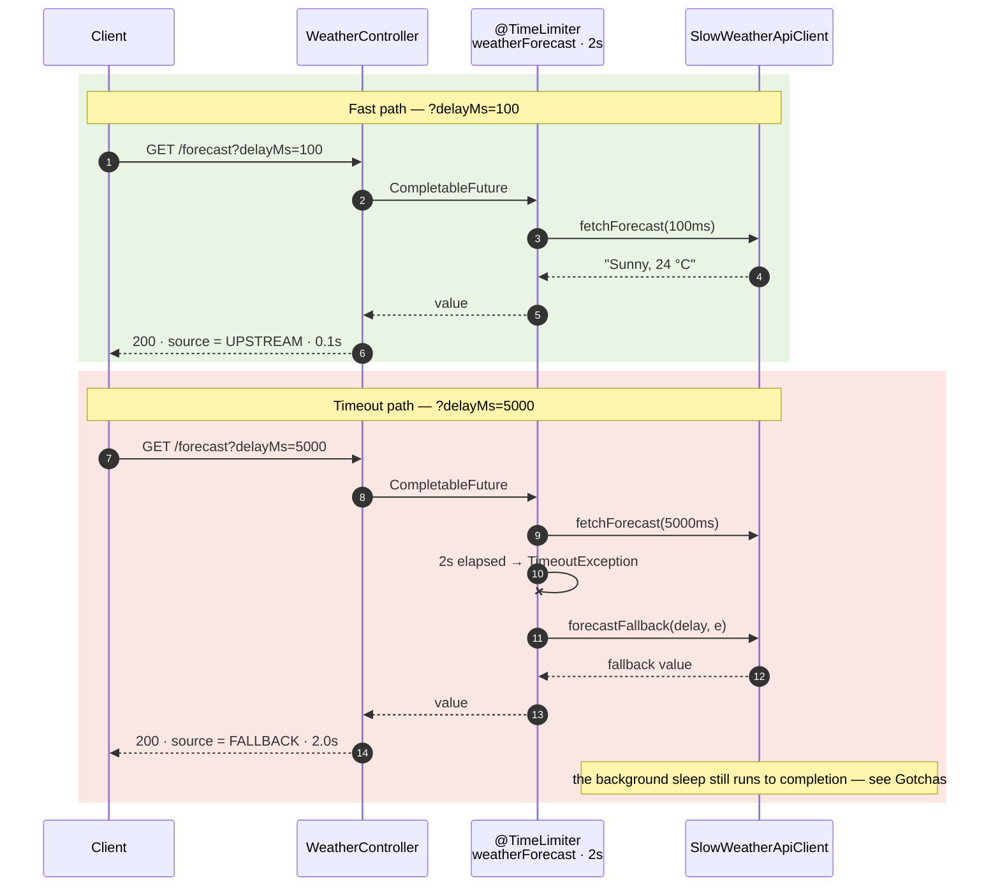
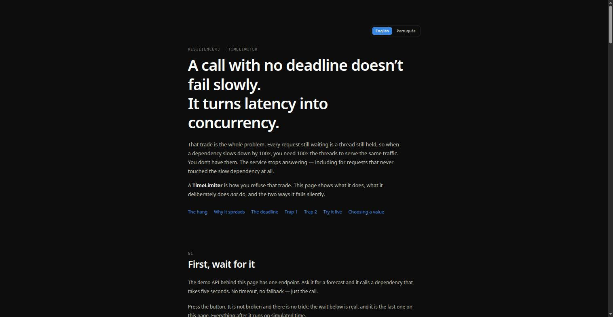
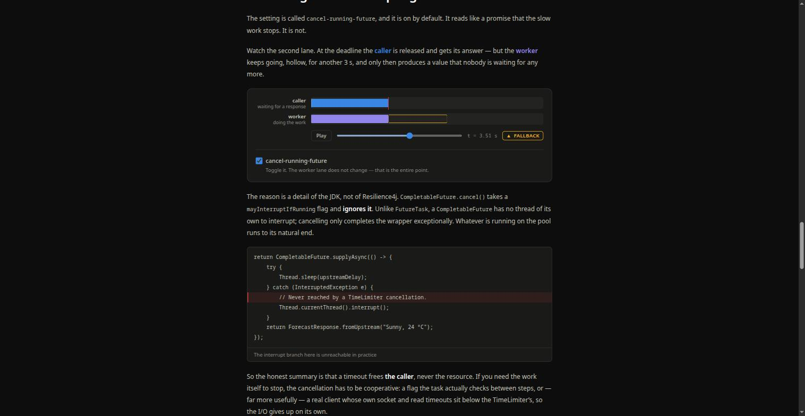
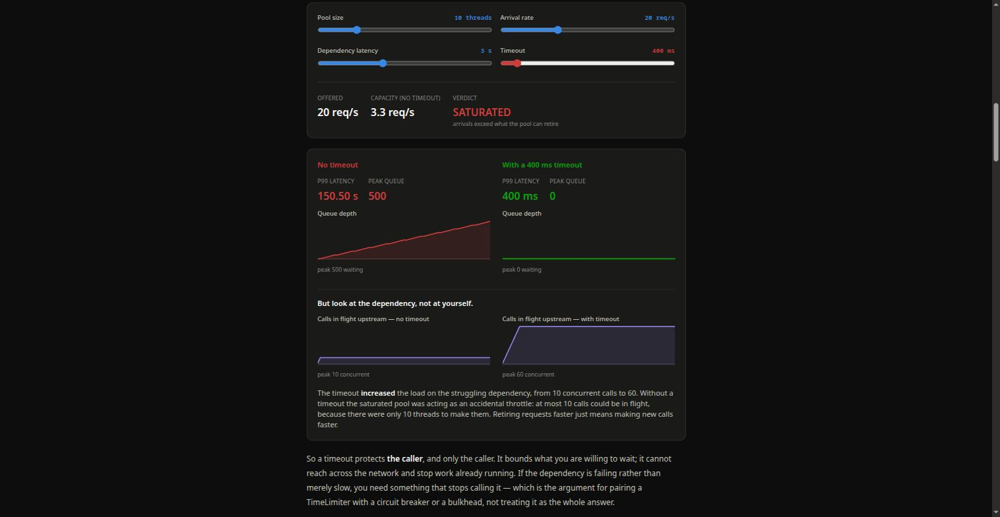
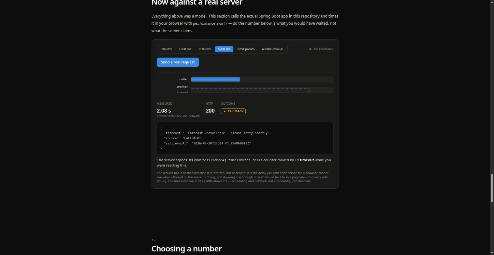
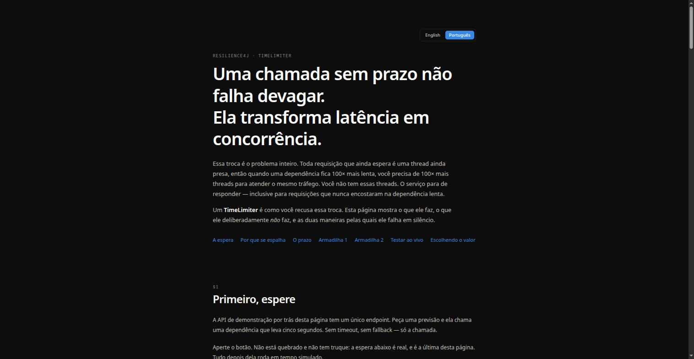

<div align="center">

# ⏱️ Resilience4j TimeLimiter

**Bounding a slow dependency in Spring Boot** — one endpoint, two outcomes, and the two traps that make `@TimeLimiter` fail silently.

[](https://github.com/arthurd3/time-limiter-resillience4j/actions/workflows/ci.yml)
[](LICENSE)


[**How it works**](#-how-it-works) · [**Run it**](#-run-it) · [**Try it**](#-try-it) · [**Teaching page**](#-the-teaching-page) · [**Gotchas**](#-gotchas) · [**Tests**](#-tests)

</div>

---

## 🧩 How it works

A `TimeLimiter` puts a ceiling on how long a caller will wait for a dependency. When the ceiling is
hit, a **fallback** answers instead — the client gets a useful response at a predictable latency
rather than a hung request.

The upstream here is simulated, and its latency is a **request parameter**, so both outcomes are
reachable without touching the code.



Every response is tagged with the path that produced it, so the behaviour is visible from the body
alone:

```java
public record ForecastResponse(String forecast, Source source, Instant retrievedAt) {
    public enum Source { UPSTREAM, FALLBACK }
}
```

## 🚀 Run it

Requires **JDK 25**. Maven comes from the wrapper.

```bash
./mvnw spring-boot:run
```

The API listens on `http://localhost:8080`.

## 🔌 Try it

**Fast upstream — answers before the limit:**

```bash
curl -s "localhost:8080/api/v1/weather/forecast?delayMs=100"
```
```json
{ "forecast": "Sunny, 24 °C", "source": "UPSTREAM", "retrievedAt": "2026-08-30T21:58:12.337660884Z" }
```

**Slow upstream — timed out, fallback answers in ~2s:**

```bash
curl -s "localhost:8080/api/v1/weather/forecast?delayMs=5000"
```
```json
{ "forecast": "Forecast unavailable — please retry shortly", "source": "FALLBACK", "retrievedAt": "2026-08-30T21:58:12.219874364Z" }
```

**Invalid input — RFC 9457 problem detail:**

```bash
curl -s "localhost:8080/api/v1/weather/forecast?delayMs=-1"
```
```json
{ "title": "Bad Request", "status": 400, "detail": "Validation failure", "instance": "/api/v1/weather/forecast" }
```

| Method | Path | Parameter | Behaviour |
| --- | --- | --- | --- |
| `GET` | `/api/v1/weather/forecast` | `delayMs` — optional, `0`–`30000` | Below the time limit → `UPSTREAM`. Above it → `FALLBACK`. Omitted → uses `demo.weather.default-delay` (5s), so it falls back. |

## 📖 The teaching page

`frontend/` holds an interactive explanation of everything below — why an unbounded call is
dangerous, what the deadline actually bounds, and both traps — with simulations you can drive and
live calls against your own running instance. Available in **English and Portuguese**.

```bash
./mvnw spring-boot:run          # terminal 1 — the API on :8080
cd frontend && npm ci && npm run dev   # terminal 2 — the page on :5173
```

<table>
<tr>
<td width="50%"></td>
<td width="50%"></td>
</tr>
<tr>
<td><b>§1–2 — the cost, felt.</b> A real five-second wait, then a thread pool you drive into saturation.</td>
<td><b>§5 — cancel is not interrupt.</b> The caller is released at the deadline; the worker keeps going, hollow, to 5s.</td>
</tr>
<tr>
<td></td>
<td></td>
</tr>
<tr>
<td><b>§2 — and what it costs the dependency.</b> The timeout fixes your p99 and <i>raises</i> upstream load from 10 to 60 concurrent calls.</td>
<td><b>§6 — against the real server.</b> Measured in the browser, with the server's own timeout counter as corroboration.</td>
</tr>
</table>

<p align="center">
  
  <br><em>The same page in Portuguese — one toggle, no separate build.</em>
</p>

The dev server proxies `/api` and `/actuator`, so the page and the API are same-origin and no CORS
setup is involved. Every section except the last works with the API stopped.

The simulations are pure functions in [`frontend/src/sim/`](frontend/src/sim), unit-tested against
the same behaviour this README describes — including the assertion that a timeout never shortens
the worker's run. Copy for both languages lives in
[`frontend/src/i18n/copy.ts`](frontend/src/i18n/copy.ts); the type makes a missing translation a
compile error, and a test checks that no `{placeholder}` was lost in translation.

## ⚙️ Configuration

All of it lives in [`src/main/resources/application.yml`](src/main/resources/application.yml).

| Property | Value | What it does |
| --- | --- | --- |
| `resilience4j.timelimiter.instances.weatherForecast.timeout-duration` | `2s` | How long the caller waits before the call is treated as failed. |
| `resilience4j.timelimiter.instances.weatherForecast.cancel-running-future` | `true` | Cancels the wrapper future on timeout — but read [Gotchas](#-gotchas) before trusting it to stop the work. |
| `demo.weather.default-delay` | `5s` | Latency the simulated upstream uses when `?delayMs` is omitted. |
| `spring.mvc.problemdetails.enabled` | `true` | Makes Spring MVC render its own exceptions as RFC 9457 problem details. |
| `demo.cors.allowed-origins` | `localhost:5173`, `localhost:4173` | Origins allowed to call the API directly. Unused when the page runs through the dev-server proxy. An explicit list rather than `*`, deliberately. |

## ⚠️ Gotchas

Two traps that cost this project a working demo. Both fail *quietly* — the app starts, the endpoint
responds, and only the behaviour is wrong.

### 1. A fallback whose signature is wrong is never called

Resilience4j resolves `fallbackMethod` reflectively, and it looks for **the guarded method's own
parameters plus a trailing exception**. Anything else does not match. This project originally had:

```java
@TimeLimiter(name = "weatherForecastLimiter", fallbackMethod = "fallback")
public CompletableFuture<String> getWeatherForecast() { ... }

public CompletableFuture<String> fallback() { ... }   // ❌ no Throwable parameter
```

The timeout fired, no fallback was found, and the caller got an HTTP 500 — with nothing louder than
a `WARN` to explain it:

```
WARN i.g.r.spring6.fallback.FallbackExecutor : No fallback method match found
java.lang.NoSuchMethodException: ...WeatherClient.fallback(, class java.lang.Throwable)
```

The fix is the trailing exception parameter:

```java
@TimeLimiter(name = "weatherForecast", fallbackMethod = "forecastFallback")
public CompletableFuture<ForecastResponse> fetchForecast(Duration upstreamDelay) { ... }

private CompletableFuture<ForecastResponse> forecastFallback(
        Duration upstreamDelay, TimeoutException e) { ... }   // ✅ args + Throwable
```

Narrow the exception type to catch only what you mean — `TimeoutException` here, rather than
`Throwable`, which would also swallow genuine upstream errors.

### 2. `cancel-running-future` does not interrupt the work

The name suggests the slow call is stopped. It is not. The setting cancels the *wrapper* future, and
`CompletableFuture.cancel()` **never interrupts the thread already running the task** — unlike
`FutureTask`, it ignores `mayInterruptIfRunning` entirely. The upstream keeps running to completion
on the common ForkJoinPool long after the client has its fallback response.

The practical consequences: the `catch (InterruptedException)` block around a simulated `sleep` is
effectively dead code, and a timeout frees *the caller*, not the resource. If you need the work to
actually stop, the cancellation has to be cooperative — a flag the task checks, or a real client
whose own read timeout is set below the TimeLimiter's.

### Also worth knowing

- **`@TimeLimiter` requires a `CompletionStage` return type.** A timeout can only be enforced
  against a value that is still pending; the aspect rejects anything else.
- **Self-invocation bypasses the annotation.** It is applied by a Spring AOP proxy, so the call has
  to arrive from outside the bean. That is why `SlowWeatherApiClient` is a separate bean from
  `WeatherService`.
- **Combining annotations?** Order matters, and it is configurable
  (`resilience4j.timelimiter.timeLimiterAspectOrder`). The usual arrangement is
  `Retry → CircuitBreaker → TimeLimiter`, so each attempt is individually bounded.

## 📈 Observability

Actuator exposes the limiter and its Micrometer meters:

```bash
curl -s localhost:8080/actuator/timelimiters
# {"timeLimiters":["weatherForecast"]}

curl -s "localhost:8080/actuator/metrics/resilience4j.timelimiter.calls?tag=kind:timeout"
# "description":"The number of timed out calls" ... {"statistic":"COUNT","value":2.0}
```

The `kind` tag separates `successful`, `timeout` and `failed` calls — the quickest way to confirm a
limiter is doing something in a running system.

## 🧪 Tests

```bash
./mvnw verify
```

[`WeatherTimeLimiterTest`](src/test/java/com/arthur/timelimiter/weather/WeatherTimeLimiterTest.java)
drives the real HTTP stack on a random port with `RestTestClient`, shortening the timeout to 500ms
so the suite stays quick:

| Test | Asserts |
| --- | --- |
| `slowUpstreamIsTimedOutAndAnsweredByTheFallback` | 200 tagged `FALLBACK` — the regression test for gotcha #1 |
| `fastUpstreamAnswersBeforeTheTimeLimit` | 200 tagged `UPSTREAM` |
| `outOfRangeDelayIsRejectedAsAProblemDetail` | 400 with `application/problem+json` |
| `timeoutsAreRecordedOnTheTimeLimiterMeter` | the `kind=timeout` counter increments |

## 📁 Project structure

```
src/main/java/com/arthur/timelimiter/
├── TimeLimiterApplication.java
├── weather/
│   ├── WeatherController.java       GET /api/v1/weather/forecast
│   ├── WeatherService.java          resolves the delay for this request
│   ├── SlowWeatherApiClient.java    @TimeLimiter + fallback  ← the interesting file
│   ├── ForecastResponse.java        record + Source enum
│   └── WeatherDemoProperties.java   binds demo.weather.*
└── common/
    ├── GlobalExceptionHandler.java  RFC 9457 problem details
    └── CorsConfig.java              allows the teaching page's origin

frontend/src/
├── sim/                  pure, deterministic simulation models (unit-tested)
├── i18n/                 en/pt copy, and the inline-markup renderer
├── components/           the shared timeline, controls, charts
└── sections/             one component per teaching beat
```

Packages are organised **by feature** rather than by layer: with a single feature, a
`controller/ service/ client/` split would put one class in each folder.

## 📄 License

[MIT](LICENSE) © Arthur Campos
